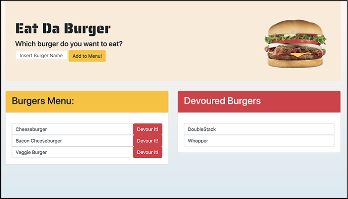

# Overview - Eat Da Burger 

The idea was to create an "Eat Da Burger" app with MySQL, Node, Express, Handlebars and a homemade ORM (yum!). It follows the Models, Views & Controllers (MVC) design pattern and uses Node and MySQL to query and route data and Handlebars to generate the HTML.

## Instructions:

When the app loads, you will see that a list of burgers on the menu to be eaten, a list of burgers that were already devoured, and an input field to add more burgers to the menu. Burgers you add will display in the Burger Menu (ready to eat) by default.

This app is the first one I've built using the Model View Controller (MVC) design principle. The model represents the data. The view responds to user actions, and the controller interprets button clicks and provides the model data to the view.

## Technologies Used
- Node
- MySQL
- NPM Packages
- Express
- Handlebars
- Homemade Object Relational Mapper (ORM)

## This app is deployed using Heroku - https://lit-tundra-92141.herokuapp.com/

**Enjoy** - Which burger (or burgers) do you want to eat? 

